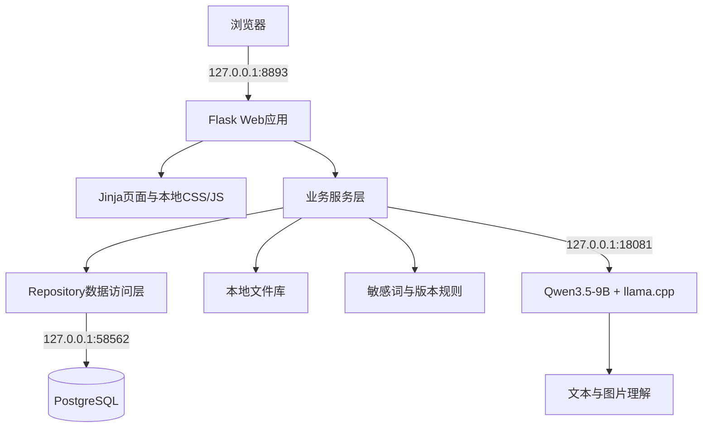
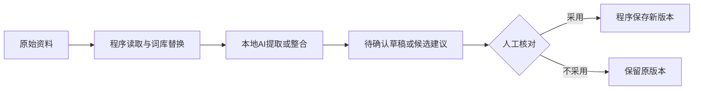

# 科研创新与项目管理系统架构与本地AI设计

更新时间：2026-09-11  
依据：当前运行配置、源码和现场复核结果

## 1. 当前架构结论

系统采用本地部署的模块化单体架构。浏览器访问 Flask 应用，页面由 Jinja 模板和本地静态资源生成；业务数据保存到 PostgreSQL，附件和导出文件保存在受控本地文件目录；本地 Qwen3.5-9B 通过 llama.cpp 的 OpenAI兼容HTTP接口提供文本与图片理解能力。

系统不是前后端完全分离的SPA，也没有引入 FastAPI。当前架构适合现有功能规模和单机演示目标。

## 2. 运行组件

| 组件 | 当前实现 | 固定位置或端口 |
| --- | --- | --- |
| Web应用 | Flask、Jinja、Bootstrap、本地JavaScript | `127.0.0.1:8893` |
| 关系型数据库 | PostgreSQL、SQLAlchemy Core、Alembic迁移 | `127.0.0.1:58562` |
| 生成模型 | Qwen3.5-9B Q8_0 | `127.0.0.1:18081` |
| 模型运行时 | llama.cpp server，离线、单路推理、8192上下文 | 本机进程 |
| 图片能力 | 9B模型与 `mmproj-F16.gguf` | 与生成模型共同加载 |
| 文件存储 | 本地受控目录 | 项目附件、报告和导出文件 |
| 备份 | `pg_dump`数据库快照与文件归档 | 本地备份目录 |

## 3. 模型配置

- 当前模型名称：Qwen3.5-9B。
- 当前量化：Q8_0。
- 当前接口协议：OpenAI兼容HTTP，仅用于本地调用，不是OpenAI云服务。
- 当前上下文：8192。
- 推理模式：关闭思考输出、串行推理、Metal/GPU层加载。
- 图片能力：通过匹配的视觉投影文件启用。
- 当前2B模型：已从产品模型目录移除，没有与9B同时加载。
- DeepSeek：当前关闭。

设置页面必须根据真实健康检查和模型身份显示状态。只有模型端口可达且模型名称匹配时，状态才显示为绿色。

## 4. AI调用边界

模型负责语义理解、资料归并、图片提取和措辞建议。程序固定来源版本、执行敏感词替换、阻止并发覆盖并保存审计信息。人员选择资料、核对事实、处理冲突并决定是否形成新版本。

## 5. 文档与敏感内容设计

1. 原始文件保留，不直接覆盖。
2. 报告整合时固定文件编号、文件版本和SHA-256。
3. 工作文本按选定词库版本执行确定性替换，再进入模型。
4. 命中敏感词库的原图不直接进入报告或DOCX，只保留脱敏后的提取结果。
5. 已保存报告固定其词库版本和来源快照，后续词库更新不倒改历史版本。
6. 敏感词规则通过新版本维护；删除需求使用禁用并保留历史。

## 6. 安全与可恢复性

- 业务页面需要登录，写操作使用CSRF保护。
- 数据库和模型绑定本地地址。
- 模型运行时启用离线参数。
- 备份包含数据库快照、文件归档和哈希清单。
- 当前最新v3数据备份已经完成哈希校验；最近一次独立恢复对账使用此前备份完成。

## 7. 当前架构限制

- 当前只验证这台 Mac，没有验证其他操作系统和甲方现场机器。
- 当前是服务端模板渲染架构，不提供独立前端应用。
- 当前没有任意外部Word文件的浏览器内完整所见即所得编辑能力。
- 当前没有多生成模型同时加载、RAG、向量检索业务闭环或智能体流程。
- 正式源码交付仍需形成干净、可回退的版本提交。
