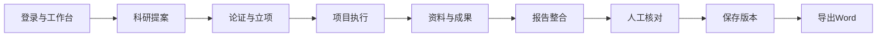

# 科研创新与项目管理系统流程与界面设计

更新时间：2026-09-11

## 1. 科研业务主流程

每一步产生下一步可以继续使用的业务数据。提案、项目、文件和报告之间保留明确关联，退出并重新登录后仍可回读。

## 2. 文档数据流程

| 子流程 | 文档怎么来 | 系统怎么处理 | 最终到哪里 |
| --- | --- | --- | --- |
| 资料来源 | 提案和项目上传、文件夹上传、标准、模板、图片、过程记录 | 记录文件编号、版本、归属和哈希 | 项目资料库与报告来源候选 |
| 入库与关联 | 用户选择所属提案、项目或报告 | 保存业务关系，不覆盖原件 | 对应业务对象的资料列表 |
| 插入 | 上传资料或加入报告来源 | 固定当时文件版本 | 报告来源快照 |
| 编辑 | 人工修改业务字段或报告正文 | 校验并保存 | 新业务状态或新报告版本 |
| 合并 | 选择1至8份文字或图片资料 | 本地AI形成独立待确认草稿 | 人工核对页面 |
| 删除 | 移除文件或目录关联 | 受控处理并保留审计 | 不再显示于当前业务关系 |
| 输出 | 选择已保存报告版本 | 生成带版本、来源和图片的DOCX | 下载文件与历史版本 |

## 3. AI操作流程

### 3.1 提案建议

用户填写原始依据 → 点击“AI科研提案助手” → 查看字段建议 → 逐项选择采用 → 保存提案。

### 3.2 图文报告整合

用户选择文字和图片资料 → 程序固定来源版本并执行敏感词替换 → 本地模型提取图片和整合资料 → 生成独立草稿 → 人工编辑核对 → 保存为新报告版本。

### 3.3 框选措辞建议

用户在报告正文中框选文字 → 点击“AI选区措辞建议” → 系统返回1至3条候选 → 用户点击采用 → 当前选区被替换 → 用户决定是否保存新版本。

## 4. 敏感词库维护流程

管理员进入“辅助工具 → 敏感词库维护”，可以逐条编辑原词、代称和启用状态，也可以导入JSON。修改必须先预览，再确认保存为新版本；历史版本可回看。新增规则使用“＋ 添加规则”按钮，删除需求通过禁用实现。

## 5. 主要界面结构

| 页面 | 核心内容 | 关键操作 |
| --- | --- | --- |
| 登录页 | 品牌、科研主线、本地运行状态、账号输入 | 登录、进入系统介绍 |
| 工作台 | 六个主要业务入口和概览 | 进入提案、项目、专家、资源、辅助工具 |
| 项目详情 | 基本信息、资料、进展、变更、成果、报告 | 上传、编辑、关联、创建报告 |
| 报告页面 | 正文、来源快照、历史版本、AI入口 | 整合草稿、框选建议、保存版本、导出DOCX |
| 模型设置 | 模型名称、能力、加载状态 | 观察绿灯和模型身份 |
| 敏感词库 | 当前版本、规则表、导入和历史 | 添加、编辑、启停、预览、保存 |
| 系统介绍 | 左侧七项目录、右侧结构图 | 汇报系统功能、数据流、AI和架构 |

## 6. 领导汇报页面结构

左侧目录依次为：系统总览、执行流程、系统功能、数据流程、本地AI、系统架构、交付结果。右侧一次显示一个章节，每个章节使用短文字配合HTML/CSS流程图或结构图。页面针对当前Mac桌面和投影环境设计，移动端不在本次范围。

## 7. 现场建议顺序

1. 打开系统介绍页，先说明系统解决什么问题。
2. 讲科研主流程和文档数据流程。
3. 说明AI只在提案、图片提取、报告整合和框选建议中发挥作用。
4. 登录系统，查看模型绿灯和敏感词库入口。
5. 打开已验证科研项目与报告，展示来源、版本和AI标识。
6. 导出并打开含图DOCX。
7. 退出后重新登录，回读项目和报告。
